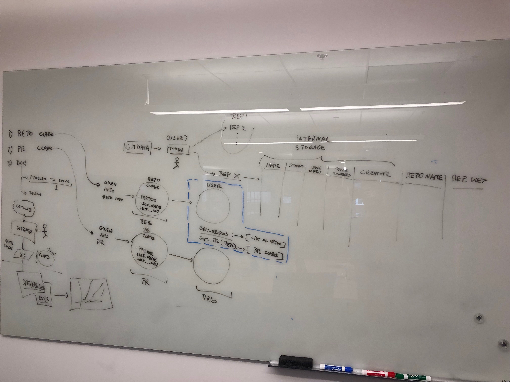

# gitdata_project

## Documentation

[Slideshow Documentation](Syapse_Gitdata_Project.pdf)

Structure Sketch:

## Sample Output

Open Pull Requests:

Activity:

Time to Close Pull Requests:

Contributing Users:

Proportion of Closed PRs Merged:

